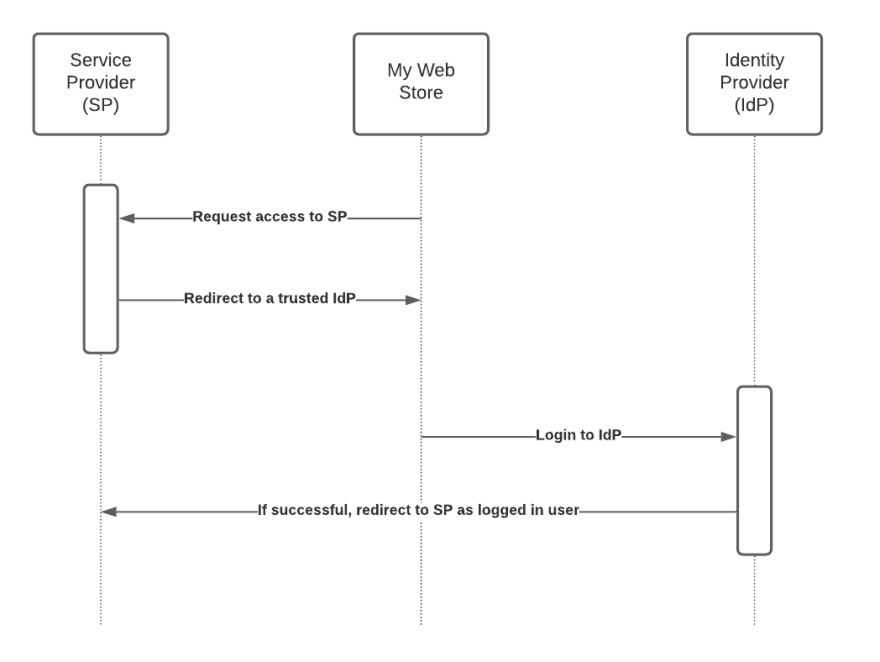
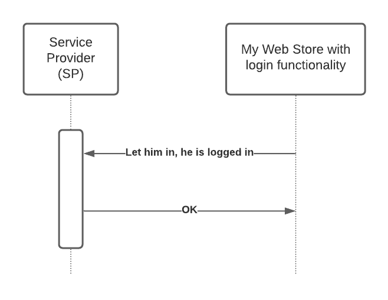

# Overview
SAML (Security Assertion Markup Language) is an XML and protocol standard used mostly in federated identity situations. For the most part, you will see SAML used with Single Sign On implementations. Basically, it is a standard way of passing authentication information securely across domain boundaries. One of the common ways to pass SAML parameters is via an HTTP POST parameter. The .NET framework has all of the components necessary to accomplish this. There are also packages and components that you can purchase that literally does the same thing

First of all, we need to create a X.509 Certificate for signing our XML.

Please refer [CREATE X.509 Certificate](https://www.linkedin.com/pulse/create-self-signed-x509-certificate-using-openssl-windows-bhosale/)

when create the X.509 certificate, will get the the X.509 certificate and a private key of the certificate. Then need to use the both to create a full certificate(.pfx)

Can generate the public key by using the .pfx certificate

Need to provide this public certificate to the service provider to verify the SAML signature.

[Example of SAML responses](https://www.samltool.com/generic_sso_res.php)


# 1. What is Single Sign-On at all?
Suppose you have a web application that people are using to do one thing X, but you are doing it great. For example, it would be a web store allowing to order a custom T-shirt printing by uploading some funny and pretty images found in the internet.

You are looking for ways to extend its functionality by adding some more capabilities for your users, but you don't want to lose the focus on this thing that you are doing best of all.

One way would be to integrate your web application with other services, such as a cool image provider, a trends meter, a delivery service, etc. It would allow your users to seamlessly move between different services (for example: looking for a cool image, checking trends, and uploading this image to your custom printing service) and do multiple things using only your web application.

[Single Sign-On](https://en.wikipedia.org/wiki/Single_sign-on) simplifies authentication flow and allows your users to sign in only once (on your web application) with their login/password (or even more innovative mechanisms, like [FIDO2](https://fidoalliance.org/fido2/), if you use such) and use more integrated services by simple clicks without the need to log in again and again. It allows you to extend the functionality of your product by adding more value with relatively low investments.

# 2. SAML
[SAML](https://en.wikipedia.org/wiki/Security_Assertion_Markup_Language) is one of the standard ways of doing Single Sign-On. For a long time, extensive enterprise services use this mechanism as one of the most secure and proven methods to exchange sensitive authentication and authorization information, like logins, passwords, emails, user accounts, etc. But it's not that complicated to add this solution between smaller businesses and enable cool integrations.

SAML is one of the most secure way to integrate with third-party among many other options. It allows parties to use asymmetric encryption [(RSA ](https://en.wikipedia.org/wiki/Security_Assertion_Markup_Language)) based on secure X.509 certificates. As of 2021, the standard is in [version 2](https://en.wikipedia.org/wiki/SAML_2.0).

I should note that it might be better for you to trust one of many existing boxed solutions with a proven history and from vendors responsible for their code and overall solution. However, as a developer, I know that businesses may need much more flexibility and customization in their products, so I want to provide more details and working example using C#, so you can easily reuse this with your ASP.NET application.

# 3. SAML Workflow


# 4. Overview of the Code

In order to accomplish a SAML post, the overall process will take place by accomplishing three major steps:

- An XML transaction will built based on the XML standard.
- The XML will need to be signed.
- And finally, the entire string will be Base64 encoded.

## 4.1 XML transaction will built based on the XML standard

### 4.1.1 Create Assertion

Need to create assertion to buld the attributes property for the SAML response.When creating the attributes need to focus on below properties
- Name
- NameFormat
- AttributeValue

### 4.1.2 Create SAML Response
when we are creating the SAML response we need to take care the below properties
- ID
- Issuer
- IssueInstant
- Destination
- Version
- Status
- Items

### 4.1.3 Serialize To XML
We need to serialize the SAML response into XML. When serializing the SAML response to XML, we can add the namespaces & schemas as we want
```<language>
  XmlSerializerNamespaces ns = new XmlSerializerNamespaces();
  ns.Add("xsi", XsiSchema);
  ns.Add("xsd", XsdSchema);
  ns.Add("samlp", "urn:oasis:names:tc:SAML:2.0:protocol");
  ns.Add("saml", "urn:oasis:names:tc:SAML:2.0:assertion");
```

## 4.2 The XML will need to be signed.

### 4.2.1 SignAssertion
We can sign the XML assetion by using the our X.509 certificate(full cerificate). When signing the XML for assertion the digital signature and the certificate will add within the assertion section in the XML

### 4.2.2 SignResponse
We can sign the XML assetion by using the our X.509 certificate(full cerificate). When signing the XML for assertion the digital signature and the certificate will add within the assertion section in the XML

## 4.3  Base64 encoded
After sign the XML string we need to encode into base64

# 5.Integration 
You have a web application that implements some authentication workflow and allows users to sign in with their login and password. It means that you are the Identity Provider, and by doing this, you can eliminate some redundant steps and make a process simpler. So, imagine that we combine Identity Provider and your Web Store into one entity, like this:



It simplifies the overall picture. However, it's not that simple under the hood. What actually should happen in the end is we should have an XML document called SAMLResponse prepared and encoded in Base64. You have to send this document via an HTTP POST request to the service provider to authenticate the user and automatically redirect his browser to the third-party target service
